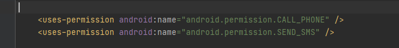
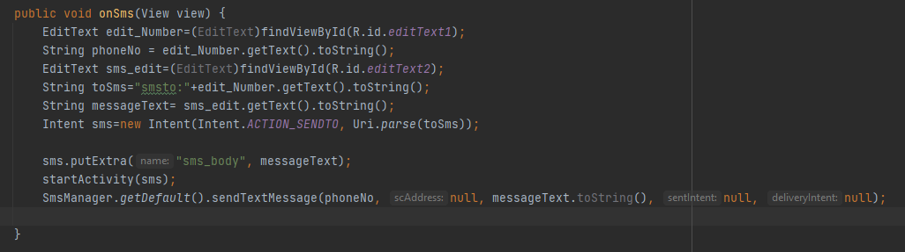
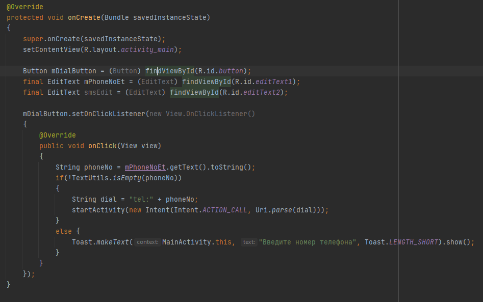

# Деревцов Илья 803в1

Создаем новый проект и добавил 2 TextEdit и 2 Button.

Добавляем разрешения на осуществления вызова и отправки СМС в файле AndroidManifest.xml.

</img>

Добавляем обработчик события по кнопке «Отправить СМС».

</img>

Вносим изменения в функцию «onCreate».

</img>

Проверяем работу

</img>

</img>

</img>

</img>

</img>
