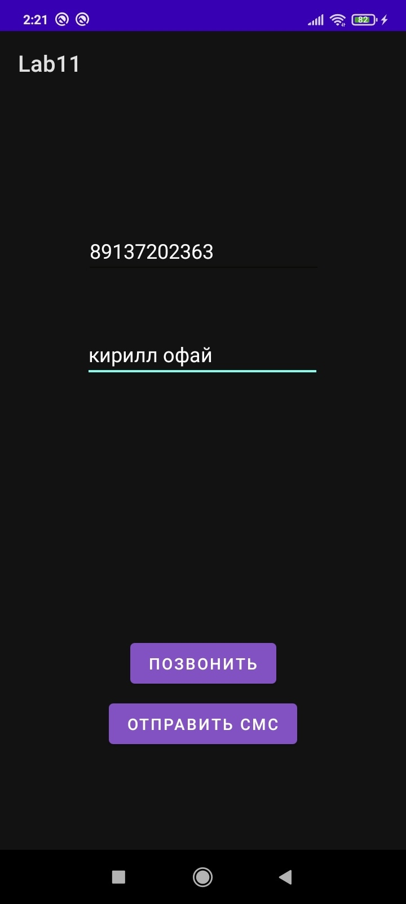
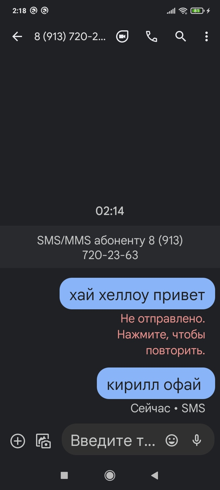
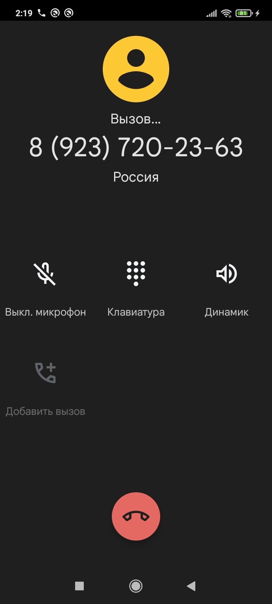
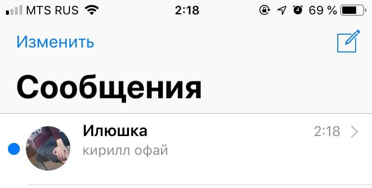

# Деревцов 803в1

Создаем новый проект и добавляем 2 TextEdit и 2 Button. 

Добавляем разрешение на осуществления вызова и отправки СМС в файле AndroidManifest.xml. 

</img>

Добавляем обработчик события по кнопке «Отправить СМС».

</img>

Вносим изменения в функцию «onCreate».

</img>

проверяем работу

</img>

</img>

</img>

</img>

</img>
